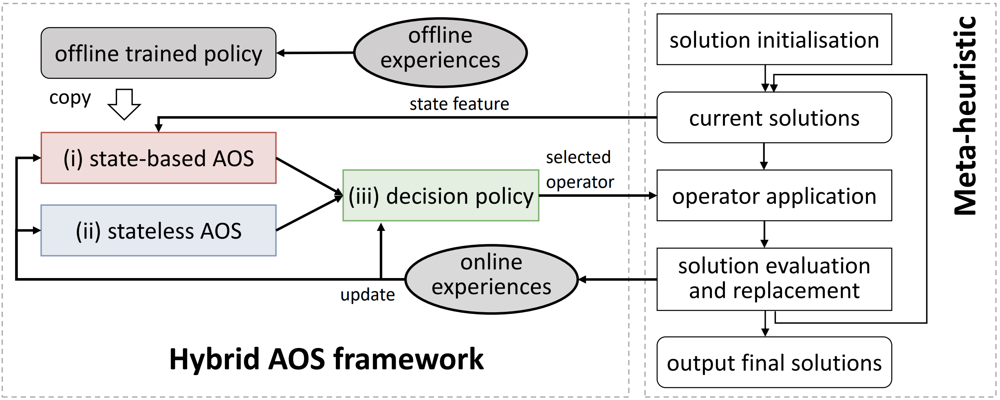

# HybrirdAOS


Implementation of paper **"Learning from Offline and Online Experiences: A Hybrid Adaptive Operator Selection Framework"**, which is accepted at *GECCO* 2024 and is the only one **Best Paper Award nomination** in L4EC track. [[Paper]](https://dl.acm.org/doi/abs/10.1145/3638529.3654062)





## Citing

Learning from Offline and Online Experiences: A Hybrid Adaptive Operator Selection Framework, Jiyuan Pei, Yi Mei and Jialin Liu. Proceedings of the Genetic and Evolutionary Computation Conference (GECCO), ACM, pp. 1017-1025, 2024

```
@inproceedings{HybridAOS,
author = {Pei, Jiyuan and Liu, Jialin and Mei, Yi},
title = {Learning from Offline and Online Experiences: A Hybrid Adaptive Operator Selection Framework},
year = {2024},
isbn = {9798400704949},
publisher = {Association for Computing Machinery},
address = {New York, NY, USA},
url = {https://doi.org/10.1145/3638529.3654062},
doi = {10.1145/3638529.3654062},
pages = {1017–1025},
numpages = {9},
keywords = {adaptive operator selection, hyper-heuristic, meta-heuristic, learn to optimise, experience-based optimisation},
location = {Melbourne, VIC, Australia},
series = {GECCO '24}
}
```


## Repository Structure

```
├── README.md
├── conda_env.yml
├── requirement.txt
├── Continual_DE-DDQN/            # Continuous optimisation experiments and scripts
│   ├── test/                     # Test scripts and validation for continuous problems
│   │   ├── callbacks.py
│   │   ├── DE-DDQN_conda_env.yml
│   │   ├── DE-DDQN_requirement
│   │   ├── dqn_ea_weights.h5f
│   │   ├── jointdqn.py
│   │   ├── python/               # helper package used by tests
│   │   │   ├── __init__.py
│   │   │   ├── AUTHORS
│   │   │   ├── exceptions.py
│   │   │   └── utilities.py
│   │   ├── validate_bbob2023.py
│   │   ├── validate_cec2005.py
│   │   ├── validate_cec2017.py
│   │   ├── validate_dqn.py
│   │   └── envs/
│   │       └── ea/
│   │           ├── de.py
│   │           └── stateless_aos.py
│   └── train-NN/                 # State-based AOS training scripts and weights
│       ├── callbacks.py
│       ├── dqn_ea_weights-R1.h5f
│       ├── dqn_ea_weights-R2.h5f
│       ├── dqn_ea_weights-R3.h5f
│       ├── train_dqn.py
│       └── envs/
│           └── ea/
│               ├── de_R1.py
│               ├── de_R2.py
│               └── de_R3.py
└── CVRPTW_GSF_DQN/               # CVRPTW experiments and environment
    ├── callbacks.py
    ├── dqn_GSF_model.h5f
    ├── jointdqn.py
    ├── train_dqn.py
    ├── validate_dqn.py
    ├── validate_R_RC.py
    └── env/
        ├── GSFCVRPTW_train.py
        ├── GSFCVRPTW_test.py
        ├── stateless_aos.py
        └── instances/            # Problem instance JSON files
            ├── c101.json
            ├── c102.json
            ├── ...
            └── rc208.json
```


**Built upon**: [DE-DDQN](https://github.com/mudita11/DE-DDQN)

## Requirements

The dependencies of this project are listed in requirements.txt and conda_env.yml. 

## Quick Start

For continual problems
```
python validate_cec2005.py
```

For CVRPTW
```
python validate_R_RC.py
```

---
Code is currently under cleaning, refactoring, and documenting. 

